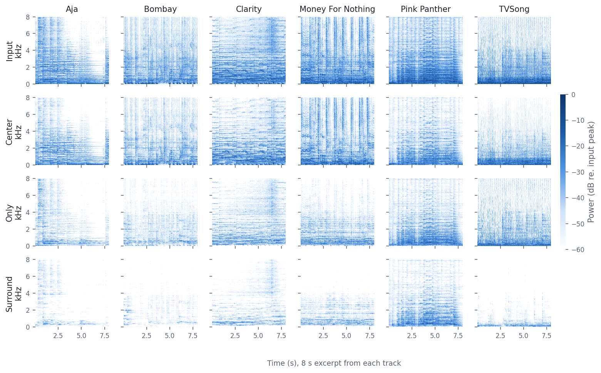
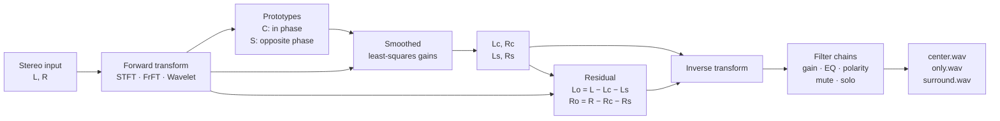
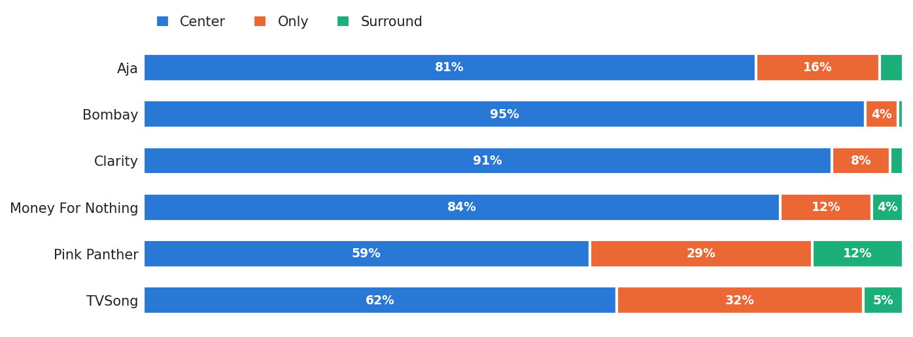

<h1 align="center">CHORUS</h1>

<p align="center">
  <b>C</b>HORUS <b>H</b>armonizes <b>O</b>utputs from <b>R</b>econstructed <b>U</b>pmixed <b>S</b>ignals
</p>

<p align="center">
  
  
  
</p>

CHORUS splits a stereo recording into three stereo stems: **center**, **only**, and
**surround**. It finds the sound that both channels share in phase, the sound that both
channels share in opposite phase, and the sound that is in one channel only. The three
stems add back to the input with an error of about 1e-16.

CHORUS has three parts:

- A **Python reference** (`chorus split`) for offline files, with reports and spectrograms.
- A **Rust streaming core** (`chorus-dsp`) that processes audio block by block.
- A **VST3 plugin** (JUCE + a C FFI) that runs the Rust core inside a DAW or DJ host.

<p align="center">
  <picture>
    <source media="(prefers-color-scheme: dark)" srcset="docs/images/spectrograms-dark.png">
    
  </picture>
  <br>
  <sub>An 8-second excerpt from each of the six test tracks, starting at 40% of the track. STFT path.
  Each column uses a dB scale relative to the peak of its own input.</sub>
</p>

## Contents

- [How it works](#how-it-works)
- [Installation](#installation)
- [Getting started](#getting-started)
- [Transform zoo](#transform-zoo)
- [Results](#results)
- [Contribution filters](#contribution-filters)
- [Real-time plugin](#real-time-plugin)
- [Repository layout](#repository-layout)
- [Validation](#validation)
- [Citing CHORUS](#citing-chorus)

## How it works



The method follows US Patent 9,078,077, *Estimation of Synthetic Audio Prototypes with
Frequency-Based Input Signal Decomposition*. It has four steps. Each step operates on one
time-frequency bin $(k, m)$ at a time.

**1. Transform.** CHORUS converts each channel into complex bins $L$ and $R$. The
reference transform is an STFT with a 1024-sample sqrt-Hann window and a 512-sample hop.

**2. Prototypes.** CHORUS builds two nonlinear prototypes from the shared magnitude
$A = \min(|L|, |R|)$:

$$
C = \frac{A}{2}\left(\frac{L}{|L|} + \frac{R}{|R|}\right),
\qquad
S = \frac{A}{2}\left(\frac{L}{|L|} - \frac{R}{|R|}\right)
$$

$C$ is large when the two channels have the same level and the same phase. $S$ is large
when the two channels have the same level and opposite phase. Both prototypes are zero
for a hard-panned source.

**3. Estimation.** A prototype is nonlinear, so CHORUS does not play it back directly.
CHORUS finds a real gain $w$ for each bin, so that $wX$ is the least-squares match to
the prototype $P$. The gain uses exponentially smoothed statistics with
`--smoothing-alpha` $\alpha$:

$$
\Phi_{PX}[m] = \alpha\,\Phi_{PX}[m-1] + (1-\alpha)\,P X^{*},
\qquad
\Phi_{XX}[m] = \alpha\,\Phi_{XX}[m-1] + (1-\alpha)\,|X|^{2}
$$

$$
w = \frac{\mathrm{Re}\,\Phi_{PX}}{\max(\Phi_{XX},\ \varepsilon)}
$$

The estimate $wX$ is a scaled copy of the input bin. Thus it keeps the original phase
and adds no nonlinear artifacts. CHORUS makes four estimates:

| Contribution | Prototype | Source | Estimate |
|---|---|---|---|
| `Lc` | $C$ | $L$ | $w_{C,L}\,L$ |
| `Rc` | $C$ | $R$ | $w_{C,R}\,R$ |
| `Ls` | $S$ | $L$ | $w_{S,L}\,L$ |
| `Rs` | $S$ | $R$ | $-w_{S,R}\,R$ |

**4. Residual and reconstruction.** The "only" contributions are what is left:
$L_o = L - L_c - L_s$ and $R_o = R - R_c - R_s$. Thus
$L_c + L_o + L_s = L$ in every bin. The transforms are tight frames, so the three stems
add back to the input in the time domain as well.

### What goes where

The table shows the energy share of each stem for white noise at four pan positions.
To make this table, run the four cases through `ChorusProcessor` with default settings.

| Source | Center | Only | Surround |
|---|---:|---:|---:|
| Equal level, same phase | 100% | 0% | 0% |
| Panned 2:1, same phase | 67% | 33% | 0% |
| Hard left | 0% | 100% | 0% |
| Equal level, opposite polarity | 0% | 0% | 100% |

## Installation

Requirements:

| Part | Requirement |
|---|---|
| Python reference | Python 3.12+, [Poetry](https://python-poetry.org) |
| Rust core and CLI | Rust stable, Cargo |
| Plugin | CMake 3.22+, a [JUCE](https://github.com/juce-framework/JUCE) checkout |

```bash
git clone https://github.com/mcbaron/CHORUS.git && cd CHORUS
poetry install                                                      # Python reference
cargo build --release --manifest-path rust/chorus-dsp/Cargo.toml    # Rust CLI
```

## Getting started

Split a stereo WAV file:

```bash
poetry run chorus split song.wav --out-dir out/song
```

The command writes these files:

```text
out/song/
├── center.wav        [Lc, Rc]   32-bit float
├── only.wav          [Lo, Ro]
├── surround.wav      [Ls, Rs]
├── report.json       settings, levels, reconstruction check, transform comparison
├── report.md         the same report as Markdown
└── spectrograms/     input_left, input_right, Lc, Rc, Lo, Ro, Ls, Rs (.png)
```

The CLI reads WAV only. To use an MP3 file, convert it first:

```bash
ffmpeg -i song.mp3 song.wav
```

### CLI options

| Flag | Default | Description |
|---|---|---|
| `--transform` | `stft` | `stft`, `frft`, or `wavelet` |
| `--frame-size` | `1024` | Frame length in samples (STFT and FrFT) |
| `--hop-size` | `512` | Hop length in samples (STFT) |
| `--smoothing-alpha` | `0.9` | Smoothing $\alpha$ for the estimator, in $[0, 1)$ |
| `--epsilon` | `1e-9` | Floor for the estimator denominator |
| `--filters` | none | Path to a JSON filter config. See [Contribution filters](#contribution-filters). |

### Rust CLI

The Rust binary uses the streaming core. It writes the three stems but no report.
For STFT and FrFT, its stems match the Python stems to 3e-8, the precision of a 32-bit
float WAV file. The wavelet path processes blocks, so its stems differ from Python.

```bash
rust/chorus-dsp/target/release/chorus_split song.wav out/song --transform stft --smoothing-alpha 0.9
```

### Python API

```python
from chorus.core import ChorusConfig, ChorusProcessor
from chorus.io import read_stereo_wav

sample_rate, audio = read_stereo_wav("song.wav")          # (samples, 2) float64
result = ChorusProcessor(ChorusConfig(sample_rate=sample_rate)).process(audio)

result.center, result.only, result.surround               # (samples, 2) each
result.contributions["Ls"]                                # one channel of one stem
```

## Transform zoo

All three transforms use the same prototypes and estimator. Only the time-frequency
representation changes.

| Transform | Representation | Max abs residual | Speed (× real time) | Status |
|---|---|---:|---:|---|
| **STFT** | 1024-sample sqrt-Hann, 50% overlap | 7.8e-16 | 76× | Reference |
| **FrFT** | Order 0.5, 1024-sample sqrt-Hann OLA | 1.2e-15 | 32× | Experimental |
| **Wavelet** | Daubechies-4, 3 levels | 8.9e-16 | 2.3× | Experimental |

<sub>Python reference, a 20 s excerpt from each of the six test tracks, 44.1 kHz, Apple M4.
"Max abs residual" is <code>max |input − (center + only + surround)|</code>, worst track.
Speed is the median over the six tracks.
To make this table, run <code>scripts/readme_assets.py</code>.</sub>

## Results

Energy share of each stem for the six test tracks. Full tracks, STFT path, default settings:

<p align="center">
  <picture>
    <source media="(prefers-color-scheme: dark)" srcset="docs/images/energy-dark.png">
    
  </picture>
</p>

| Track | Length | Center | Only | Surround |
|---|---:|---:|---:|---:|
| `Steely Dan - Aja` | 8:01 | 81% | 16% | 3% |
| `El Guincho - Bombay` | 3:39 | 95% | 4% | 1% |
| `Adam Neeley - Clarity` | 3:24 | 91% | 8% | 2% |
| `Dire Straits - Money For Nothing` | 4:06 | 84% | 12% | 4% |
| `Mancini - Pink Panther` | 2:37 | 59% | 29% | 12% |
| `Blue Man Group - TVSong` | 2:01 | 62% | 32% | 5% |

All 18 full-track runs of `chorus split` (six tracks, three transforms) pass the
reconstruction check. The largest residual is 1.3e-15.

To build the figures and these numbers from your own tracks, use this command.
It reads WAV or MP3 files and needs `ffmpeg`.

```bash
poetry run python scripts/readme_assets.py tests/test_tracks_wav/*.wav
```

## Contribution filters

A filter chain changes one contribution after reconstruction. Write the chains as JSON:

```json
{
  "Lc": [{"type": "gain", "db": -6.0}],
  "Lo": [{"type": "eq", "mode": "highpass", "frequency_hz": 120.0, "q": 0.707}],
  "Ro": [{"type": "polarity"}],
  "Ls": [{"type": "mute"}],
  "Rs": [{"type": "solo"}]
}
```

```bash
poetry run chorus split song.wav --out-dir out/song --filters filters.json
```

| Type | Parameters | Effect |
|---|---|---|
| `unity` | none | Pass-through (default for each contribution) |
| `gain` | `db` in [−60, 24] | Scale by `db` |
| `polarity` | none | Invert the sign |
| `mute` | none | Silence this contribution |
| `solo` | none | Silence all contributions that have no `solo` |
| `eq` | `mode` (`peaking`, `highpass`, `lowpass`), `frequency_hz`, `q`, `gain_db` | Biquad EQ |

CHORUS validates the config before it writes audio. An unknown contribution name, an
unknown filter type, or a parameter out of range stops the run. When a filter changes the
output, `report.json` sets `checks.filtered_output.intentionally_altered` to `true`.

## Real-time plugin

The plugin calls the Rust core through three C functions:

```c
void* chorus_create(unsigned int sample_rate);
int   chorus_process_interleaved(void* handle, const float* in, float* out, size_t frames);
void  chorus_destroy(void* handle);
```

The core buffers one frame before it gives output. The latency is 1024 samples
(23.2 ms at 44.1 kHz). Until the first frame is full, the core writes silence.

Build and test the plugin:

```bash
cmake -S plugin -B plugin/build -DJUCE_DIR=/path/to/JUCE
cmake --build plugin/build --config Release
ctest --test-dir plugin/build --output-on-failure
pluginval --validate-in-process --strictness-level 5 \
  plugin/build/CHORUSPlugin_artefacts/VST3/CHORUS.vst3
```

CMake finds `cargo` and `rustc` on `PATH`, in `~/.cargo/bin`, or in Homebrew.

## Repository layout

```text
src/chorus/             Python reference: transforms, prototypes, estimator, filters, CLI
rust/chorus-dsp/        Rust streaming core and the chorus_split and streaming_latency binaries
rust/chorus-ffi/        C ABI for the core (static and dynamic library)
plugin/                 JUCE VST3 wrapper and smoke test
fixtures/v2/            Python output fixtures that the Rust tests compare against
scripts/                Fixture generator and README figure builder
tests/                  Python tests and the test tracks
docs/                   Design specs, plans, and profiling notes
```

## Validation

```bash
poetry run pytest                                                   # Python
cargo test --manifest-path rust/chorus-dsp/Cargo.toml               # Rust core + fixtures
cargo test --manifest-path rust/chorus-ffi/Cargo.toml               # C ABI
poetry run python scripts/generate_v2_fixtures.py                   # rebuild fixtures
```

The Rust fixture tests use the Python output in `fixtures/v2/`. For each STFT case
(silence, near silence, unity bypass, center dominant, hard-panned left and right,
phase-inverted surround) and the FrFT case, each Rust stem must match the Python stem
to 1e-9 from the first sample.

## Citing CHORUS

If you use CHORUS in your research, use this BibTeX entry:

```bibtex
@misc{baron2026chorus,
  author       = {Matthew Baron},
  title        = {{CHORUS}: Harmonizes Outputs from Reconstructed Upmixed Signals},
  year         = {2026},
  howpublished = {\url{https://github.com/mcbaron/CHORUS}}
}
```

The method follows US Patent 9,078,077, *Estimation of Synthetic Audio Prototypes with
Frequency-Based Input Signal Decomposition*.
